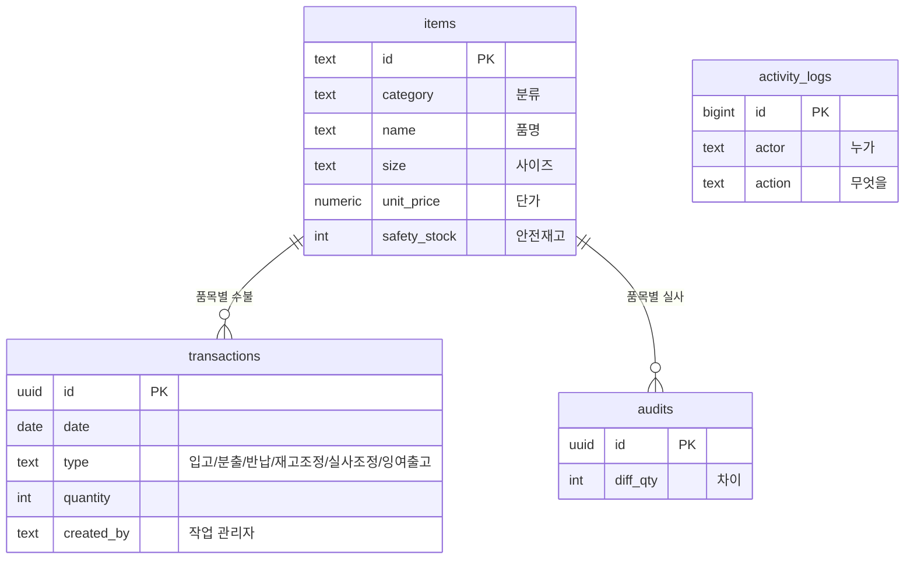
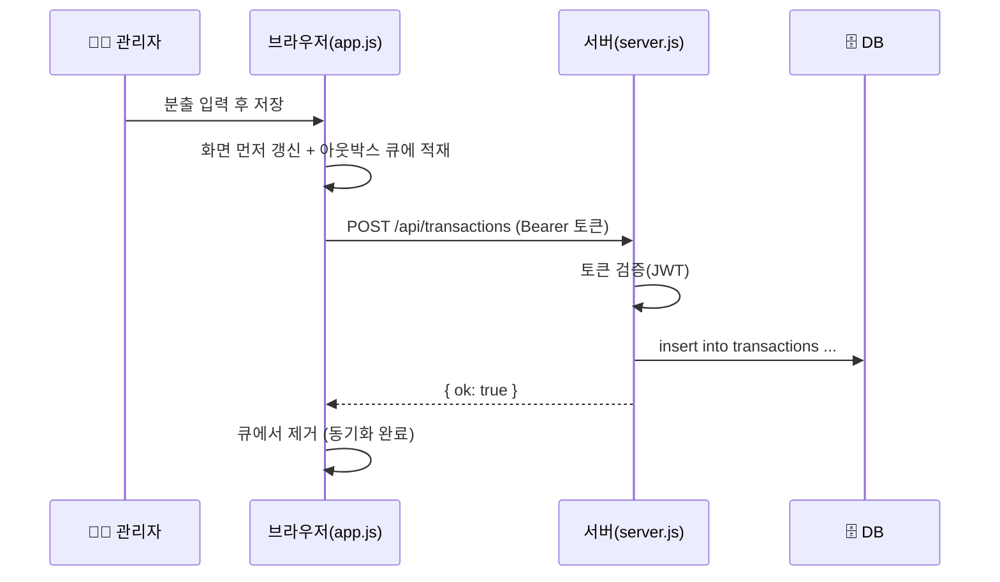

# 시공팀 유니폼 재고관리 플랫폼 — 종합 문서

> **한 줄 정의:** 전국 시공팀의 유니폼 재고를, 흩어진 수기 스프레드시트에서 **하나의 중앙 데이터 + 역할별 두 화면**으로 옮겨 "재고 가시성"과 "요청 처리"를 자동화한 사내 SCM 플랫폼.
> **이 문서:** 무엇을·왜·어떻게 만들었고, 그 결과 무엇이 얼마나 좋아졌는지를 **구조·수치·논리**로 한 번에 정리한 통합 보고서 (개요 + 기획안 + 도입효과 + 시스템 청사진 통합본).

---

## 0. 요약 (Executive Summary)

- **문제:** 재고 데이터가 개인 엑셀/브라우저에 흩어져 ①유실 위험 ②수기 계산 오류 ③시공팀↔관리자 반복 문의 ④단가·정산 재작업이 상존.
- **해결:** "기록이 진실, 재고는 계산 결과"라는 원칙으로 **중앙 DB + 백엔드 서버 + 역할별 2화면**으로 재설계. 요청은 **슬랙 자동 알림**, 단가는 **권한 분리**로 보호.
- **효과(추정):** 반복 업무 **월 약 23.5시간 / 연 약 282시간** 절감(§7 가정 기반) + 수기 오류·데이터 유실 리스크 **구조적 제거** + 재고 가시성 확보로 결품·과잉을 데이터로 판단.
- **의미:** 단순 전산화가 아니라 **SCM의 핵심(단일 진실 공급원·재고 가시성·재발주 신호)** 을 갖춘 데이터 기반이며, 향후 **AI 수요예측**으로 확장 가능한 토대를 확보.

---

## 1. 이 앱은 무엇인가

전국 시공 현장에 나가는 **작업 유니폼의 재고를 관리**하는 사내 웹 앱입니다.
본사 관리자는 **입고·분출(지급)·반납·실사**를 기록하고, 각 지역 시공팀은 **필요한 유니폼을 요청**합니다.
예전에는 데이터가 엑셀/브라우저에만 있어 쉽게 유실됐는데, 지금은 **회사 중앙 DB**에 안전하게 쌓입니다.

| 사용자 | 화면 | 하는 일 |
|---|---|---|
| 🧑‍💼 **본사 관리자** | `/` | 입·출고 기록, 실사, 정산, 재고/로그 관리, 요청 합계 |
| 👷 **시공팀(요청자)** | `/request` | 재고 실시간 조회 + 유니폼 요청(→ 슬랙 자동 알림) |

### 구조 한눈에 (3층)
```
[🧑‍💼 관리자 화면] ─┐
                    ├──▶ [🖥️ 서버] ──▶ [🗄️ 회사 중앙 DB]  ← 단 하나의 진실
[👷 시공팀 화면]  ─┘         │
                            └──▶ [💬 슬랙 알림]
```
**핵심 원칙:** 화면은 DB에 직접 접근하지 않고 **반드시 서버를 거친다.** → DB 비밀번호가 화면에 노출되지 않고, 보안·권한을 서버가 통제.

---

## 2. 왜 만들었나 — 기존 방식의 구조적 문제

유니폼 재고 관리는 전형적인 **SCM(공급망 관리)** 문제다. "무엇이·어디에·얼마나 있고, 언제 다시 채워야 하는가"를 정확히 알아야 **결품**(현장 인력이 유니폼을 못 받음)과 **과잉**(재고·비용 낭비)을 막는다. 기존 수기 방식은 이 질문에 답하지 못했다.

| # | 어려움 | 왜 생겼나 | SCM 관점의 손실 |
|---|---|---|---|
| **P1** | 데이터 유실·분산 | 파일이 개인 PC·브라우저·여러 버전에 흩어짐 | 단일 진실 공급원 부재 → 신뢰 불가 |
| **P2** | 수기 계산 오류 | 현재고를 사람이 수식·셀로 직접 관리 | 재고 정확도 저하 → 결품/과잉 오판 |
| **P3** | 반복 문의 병목 | 시공팀이 재고를 알려면 관리자에게 매번 문의 | 정보 비대칭 → 리드타임·인건비 낭비 |
| **P4** | 정산·단가 재작업 | 단가 변경 시 과거 청구를 수기로 다시 계산 | 반복 수작업 → 오류·시간 손실 |

> **핵심 통찰:** 위 4가지는 달라 보여도 뿌리는 하나다 — **"데이터가 한 곳에 없고, 숫자를 사람이 관리한다."** 그래서 해결도 하나로 모였다: **데이터를 중앙화하고, 계산을 시스템에 맡긴다.**

---

## 3. Before → After 한눈에

| 구분 | 기존 방식 (Before) | 개선 후 (After) |
|---|---|---|
| 재고 확인 | 시공팀이 담당자에게 매번 문의 → 확인·회신 | 시공팀이 **직접 실시간 조회** (문의 불필요) |
| 데이터 보관 | 개인 PC·엑셀·브라우저 (연동 안 됨, 유실) | **중앙 DB 영구 저장** (어디서나 같은 데이터) |
| 현재고 계산 | 사람이 수식·셀로 관리 (깨지기 쉬움) | **기록에서 자동 계산** (항상 일치) |
| 유니폼 요청 | 전화/메신저/구두 → 누락·오류 | 화면에서 담아 전송 → **슬랙 자동 알림 + 기록** |
| 수불·이력 | 수기 기록 (추적 어려움) | **자동 기록 + 활동 로그**(누가·언제·무엇을) |
| 부족·품절 인지 | 눈으로 확인 → 뒤늦게 발견 | **상태색·재발주 지표**로 즉시 인지 |
| 발주 판단 | 감·경험 | **회전율·수요예측·안전재고** 데이터 기반 |
| 단가 등 민감정보 | 시트 열면 다 보임 | **비밀번호 통과해야만** 조회 |
| 보고·정산 | 수작업 취합 | **엑셀 내보내기**, 담당자별 청구 자동 집계 |

> 한 줄 요약: **"흩어진 시트를 사람이 맞춰 쓰던 방식"에서 "한 곳에 모인 데이터를 시스템이 지켜주는 방식"으로** 바뀌었습니다.

---

## 4. 문제를 푼 사고의 흐름 (단계적 검증)

처음부터 큰 시스템을 설계하지 않았다. **"쓰면서 진짜 문제를 찾고, 확인되면 그때 구조를 바꾼다"** 는 흐름으로 접근했다.

```
[1단계] 일단 쓰게 만든다 (MVP · 6월)
   결정: 서버 없이 브라우저 하나, 현재고는 '저장' 대신 '계산'
        │  ← 확인된 한계: 데이터가 개인 브라우저에만 (P1)
        ▼
[2단계] 구조를 바꾼다 (대전환 · 7/29)
   결정: 회사 중앙 DB + 백엔드.  '화면 → 서버 → DB'
        비밀번호는 서버에만, 계산은 DB 뷰로 (P2 해결)
        │  ← 데이터가 모이자 새 기회: 두 번째 사용자(시공팀)
        ▼
[3단계] 서비스로 넓힌다 (완성 · 7/30)
   결정: 시공팀 공개 화면 + 슬랙 자동 요청 + 단가 권한 분리 (P3·P4 해소)
        ▼
[4단계] 운영·고도화 (8월~9월)
   결정: 사내 서버 일원화 → SCM 분석(수요·회전율·히트맵)
        → 요청 합산·준비수량 자동화
```

**특징:** "문제 확인 → 결정 → 그 결정이 낳은 다음 문제 → 다음 결정"으로 이어진다. 각 결정이 다음 기회를 열었다(데이터 중앙화 → 시공팀 셀프 조회 가능).

### 개발 타임라인
| 날짜 | 단계 | 핵심 |
|---|---|---|
| 6/15 | MVP | 브라우저 단독 재고관리 초기 구축 |
| 6/24~7/13 | MVP 보완 | 잉여출고·비번 분리·Dockerfile·재고조정 음수 |
| **7/29** | **대전환** ⭐ | 회사 전용 DB + 백엔드 전환 |
| **7/30** | **완성·정제** ⭐ | 공개 대시보드·슬랙·단가 분리·UI 통일 |
| 8/03~8/07 | 운영 정리 | 외부 호스팅 보류·GitHub 안내 페이지 |
| **8/25** | **SCM 고도화** ⭐ | SCM 분석 탭·소비 곡선·청구 권역×월 |
| 8/31~9/02 | SCM 고도화 | 사이즈×월 수요 히트맵·별표 롤링·월별 분출량 엑셀 |
| **9/03~9/04** | **운영 자동화** ⭐ | 요청 합계(창고 준비 수량)·슬랙 요약·편집/저장 |

> 단계별 상세 의사결정은 개발 기록의 각 날짜 `🤔 고민 과정`에 있다. → [개발기록/00_개요](개발기록/00_개요.md)

---

## 5. 해결책 — 구조·데이터·설계

### 5-1. 문제 → 해결 매핑
| 기존 문제 | 해결한 방식 | 적용된 원리 |
|---|---|---|
| P1 유실·분산 | 중앙 DB + 아웃박스(끊겨도 재전송) | 단일 진실 공급원, 내결함성 |
| P2 계산 오류 | 현재고를 저장하지 않고 **기록 합산으로 자동 계산**(뷰) | "기록이 진실, 재고는 결과" |
| P3 문의 병목 | 시공팀 **셀프 조회 화면** + 재발주 필요 지표 | 재고 가시성, 셀프서비스 |
| P4 정산 재작업 | 단가 변경 시 과거 청구 **자동 소급** + CSV 내보내기 | 자동화, 데이터 기반 정산 |
| (보안) 단가 노출 | 공개 API에서 단가 제외, 비번 통과 시에만 제공 | 최소 권한 원칙 |

### 5-2. 데이터 모델 (테이블 + 현재고 뷰)

**현재고는 저장하지 않고 계산합니다** — `current_stock` 뷰가 기초재고 + 수불 합계로 실시간 산출:
```sql
i.initial_stock + coalesce(sum(case t.type
    when '입고' then t.quantity   when '반납' then t.quantity
    when '분출' then -t.quantity  when '잉여출고' then 0
    else t.quantity end), 0) as current_stock
```
→ "지금 재고"가 항상 기록의 결과와 일치 → 숫자가 어긋날 일이 없음.
(시공팀 요청은 `uniform_requests`, 설정값은 `app_config`에 별도 저장 — 요청 합계·슬랙 요약용.)

### 5-3. 요청 처리 흐름 (예: 관리자 '분출' 1건)


### 5-4. 핵심 설계 결정 3가지
**① 화면 → 서버 → DB (직접 연결 금지)** — 브라우저가 DB에 직접 붙으면 비밀번호가 노출. 서버를 경유하고 비밀은 서버에만.
```js
const pool = new pg.Pool({
  connectionString: process.env.DATABASE_URL,      // 서버 env에만
  options: `-c search_path=${DB_SCHEMA},public`
});
```
**② 단가는 별도 비번으로 분리** — 공개 조회엔 단가를 아예 안 싣고, 단가는 비번 통과 시에만. "화면 잠금"이 아니라 **데이터를 안 내려주는** 진짜 보안.
```js
app.get('/api/stock', ...)     // 현재고만 (단가 없음)
app.post('/api/prices', ...)   // PRICE_PASSWORD 일치 시에만 단가
```
**③ 아웃박스(재시도 큐)로 유실 방지** — 저장은 화면 먼저 → 큐 적재 → 서버 전송. 실패해도 큐에 남아 연결되면 자동 재전송.
```js
while (true) {
  const q = loadOutbox(); if (!q.length) break;
  try { await applyOp(q[0]); } catch { break; }   // 실패 → 순서 보존 위해 중단
  const q2 = loadOutbox(); q2.shift(); saveOutbox(q2);  // 성공분만 제거
}
```

### 5-5. 기술 스택 & 화면 지도
| 층 | 기술 | 역할 |
|---|---|---|
| 화면 | HTML + **바닐라 JS**(프레임워크 없음) | 가볍고 의존성 적게 |
| 서버 | **Node.js + Express** | REST API, 인증 |
| DB | **PostgreSQL**(Supabase/AWS 서울, 회사 배정 스키마) + `pg` | 중앙 저장 |
| 인증 | **JWT** | 로그인 토큰 |
| 배포 | **Docker**(node:20-alpine) → 사내 서버 | 컨테이너 배포 |
| 알림 | **Slack 워크플로 웹훅** | 요청·요약 통지 |

```
🔐 로그인 ─비번─▶ 🧑‍💼 관리자(/) : 재고현황 · SCM분석 · 입출고 · 요청합계 · 정산 · 기록
        └─로그인없이─▶ 👷 시공팀(/request) : 센터별 재고 조회 · 유니폼 요청(장바구니)
```

---

## 6. 핵심 개선점 (기능 관점 5가지)

1. **실시간 셀프 조회** — 시공팀이 공개 대시보드에서 직접 재고 확인(분류→품목→사이즈 필터, 초성 검색). 담당자 확인·회신 왕복 소멸.
2. **중앙 데이터베이스** — 재고·수불·이력이 중앙 DB에 영구 저장. 어느 기기·누가 보든 동일 최신값, 담당자 이탈에도 안전.
3. **요청 자동화** — 담기 → 전송 → **담당자 슬랙 자동 알림**(요청일시·품목·센터 자동 정리). 요청이 기록으로 남아 누락↓.
4. **관리·분석 강화** — 상태 표시(여유/부족/품절)·재발주 지표로 결품 예방. 분석 대시보드(월별 입출고·회전율·수요예측·소비 곡선·사이즈 히트맵), 활동 로그 추적, 엑셀 내보내기.
5. **권한 분리로 안전** — 등록·수정은 관리자 로그인 후에만(무결성). 시공팀 화면은 조회·요청 전용(실수 방지).

---

## 7. 효과 — 수치·논리 근거

> ⚠️ 아래 수치는 실제 측정값이 아니라 **합리적 '가정치'** 기반 추정입니다. 7-1 가정 표의 값을 실제 값으로 바꾸면 7-2가 그대로 갱신되는 구조.

### 7-1. 가정 표 (← 실제 값으로 교체용)
| 코드 | 가정 항목 | 예시 값 |
|---|---|---|
| A1 | 관리 품목(SKU) 수 | 약 200 |
| A2 | 지역 센터 수 | 12 |
| A3 | 월 유니폼 요청 건수 | 60건 |
| A4 | 요청 1건 처리시간 | 기존 15분 → 개선 4분 |
| A5 | 월 재고 문의(왕복) | 40건 × 10분 → 개선 0분(셀프조회) |
| A6 | 단가 변경 후 과거 청구 재계산 | 월 2회 × 30분 → 개선 0분(자동 소급) |
| A7 | 데이터 유실·재작업 사고 | 분기 1회 × 4시간 → 개선 0(중앙 DB) |
| A8 | 월 정산·현황 취합 | 기존 4시간 → 개선 0.5시간(CSV) |

### 7-2. 절감 효과 (위 가정 기준)
| 항목 | 계산식 | 월 절감 |
|---|---|---|
| 요청 처리 | 60 × (15−4)분 | 11.0시간 |
| 재고 문의 제거 | 40 × 10분 | 6.7시간 |
| 단가 재계산 자동화 | 2 × 30분 | 1.0시간 |
| 유실 복구 제거 | (분기 4시간) ÷ 3 | 1.3시간 |
| 정산 취합 단축 | 4 − 0.5시간 | 3.5시간 |
| **합계** | | **≈ 23.5시간 / 월** |
| **연 환산** | ×12 | **≈ 282시간 / 년** (≒ 근무일 35일분) |

여기에 **오류·유실로 인한 비정형 손실**(재작업·결품 대응·신뢰 저하)은 별도로 구조적으로 **0에 수렴**.

### 7-3. 정성 근거 (수치로 다 안 잡히는 이득)
- **오류율:** 현재고를 사람이 안 고치므로 **계산 실수 자체가 발생 불가**.
- **유실 리스크:** 개인 기기 의존 제거 + 아웃박스 재전송 → "언젠가 크게 터지는" 사고 원천 차단.
- **정보 비대칭 해소:** 시공팀 셀프 조회 → 관리자는 '응대'가 아닌 '재고 운영'에 집중.
- **의사결정 전환:** '감' 발주 → **재발주 지표·회전율·히트맵**으로 데이터 판단.
- **감사 추적성:** 활동 로그로 "누가·언제·무엇을" → 책임·신뢰 확보.

### 7-4. 대상별 기대 효용
| 대상 | 효용 |
|---|---|
| 본사 담당자 | 반복 문의 응대↓ · 요청 자동 접수·기록 · 발주/정산 자동화 → 업무 부담↓ |
| 시공팀(현장) | 실시간 즉시 확인(대기 없음) · 간편 요청 · 요청 진행 투명화 |
| 조직 전체 | 데이터 유실 리스크 제거 · 재고 정확도·신뢰도↑ · 결품/과잉↓ · 이력 추적으로 투명성↑ |

> 정량 효과(문의 건수·응대 시간 절감 등)는 운영 후 **활동 로그·요청 기록으로 실측** 가능합니다.

---

## 8. SCM·AI 활용 관점 — 지금과 다음

**8-1. 지금(구현 완료) — "AI를 위한 전제조건"을 만든 단계**
현재 플랫폼의 본질은 **데이터 정합성 + 자동화 + 가시성**이다. 이는 AI 도입의 필수 전제 — 아무리 좋은 예측 모델도 **깨끗하고 중앙화된 데이터**가 없으면 무용하다. 이 플랫폼은 그 토대(정형화된 수불·요청·재고 데이터)를 확보했다.

**8-2. 다음(확장 로드맵) — AI로 고도화 가능한 지점**
| 단계 | 확장 아이디어 | 입력이 되는 기존 데이터 | 기대 효과 |
|---|---|---|---|
| 1 | 수요예측(센터·계절·사이즈별) | 수불·요청 이력 | 선제 발주 → 결품↓ |
| 2 | 안전재고 자동 산정 | 소요 변동성 + 리드타임 | 과잉·결품 동시 최소화 |
| 3 | 이상탐지(비정상 분출·재고 급변) | 활동 로그·수불 패턴 | 오류·부정 조기 발견 |
| 4 | 요청 자동 분류/추천 | 요청 텍스트·센터 이력 | 요청 처리 자동화 확대 |

> **메시지:** "지금은 규칙 기반 자동화, 다음은 데이터 기반 예측." 이 플랫폼은 그 전환을 **데이터부터** 준비한 설계다.

---

## 9. 현황 및 향후 계획

- **현재:** 기능 개발 완료, 사내 서버 배포·회사 DB 연동 검증 완료. SCM 분석·요청 합계까지 운영 중.
- **구성:** 관리자 플랫폼(`/`) + 시공팀 공개 대시보드(`/request`) — 하나의 데이터로 연동.
- **향후:** 외부(현장 권역장) 접근 방식 확정(사내 정책 협의) + AI 수요예측(§8) 확장.

---

## 10. 결론

이 플랫폼은 "재고 앱 하나 만들었다"가 아니라, **팀이 겪던 반복적·구조적 문제를 SCM 관점에서 재정의하고, 데이터 중앙화라는 하나의 원인부터 단계적으로 해결한** 결과물이다.

- **왜:** 흩어진 데이터·수기 계산이 유실·오류·병목·재작업을 낳았다.
- **어떻게:** "기록이 진실, 재고는 계산"이라는 원칙으로 중앙 DB·백엔드·역할별 2화면·자동 알림을 단계적으로 구축하고, SCM 분석·요청 자동화로 확장했다.
- **결과:** 반복 업무 **연 약 282시간(가정 기준)** 절감 + 오류·유실 리스크 구조적 제거 + 재고 가시성 확보 + **AI 확장 토대** 마련.

> 부록: 단계별 의사결정과 실제 코드 구성은 **[개발기록/00_개요](개발기록/00_개요.md)** 에 날짜별로 상세히 정리되어 있다.

<sub>※ 본 문서의 정량 수치는 §7-1 가정치 기반 추정이며, 실제 운영 데이터로 대체 시 자동으로 갱신되는 구조로 작성되었습니다.</sub>
